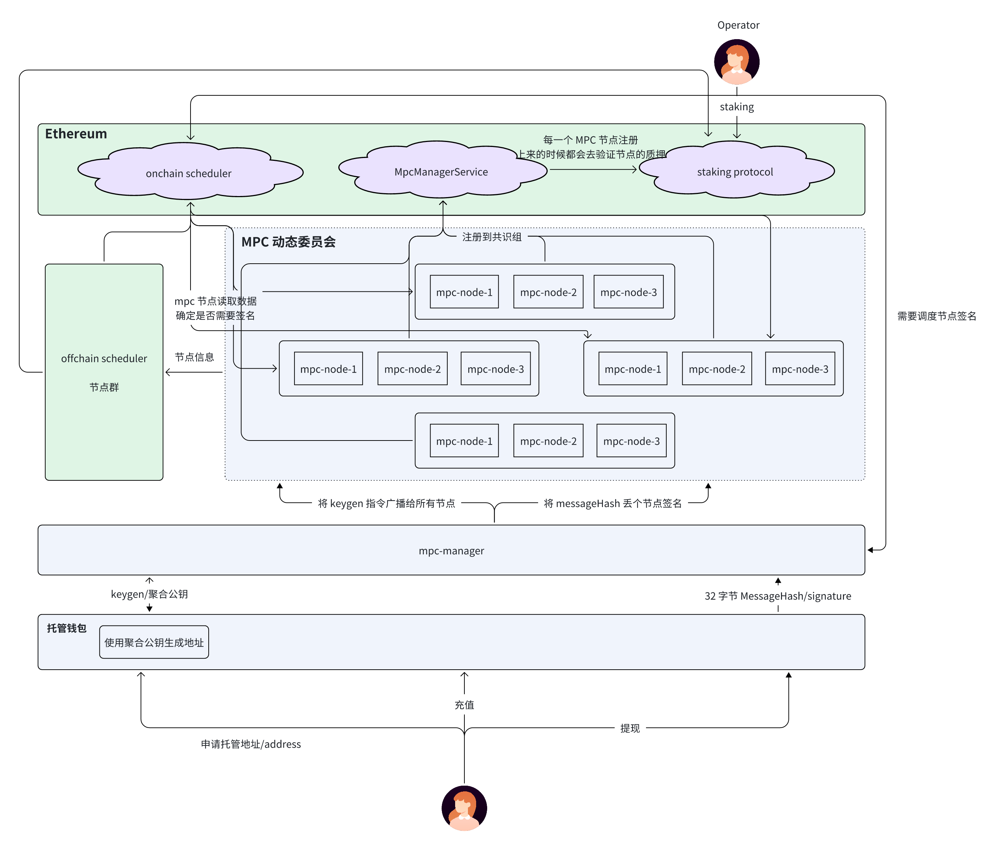
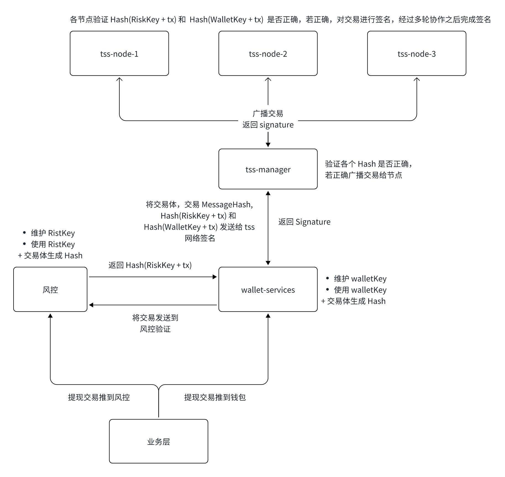

# DappLink 资金托管系统

## 一.系统介绍

### 1.系统架构

基于链上/链下协同调度的去中心化 MPC（多方安全计算）网络。整个系统由以太坊主链、MPC 动态委员会、MPC 节点集群、mpc-manager 服务以及上层托管钱包共同组成。

首先，所有 MPC 节点需由 Operator 在链上进行注册和质押，链上的 onchain scheduler 与 MpcManagerService 会根据 staking protocol 提供的节点状态，对节点进行管理与调度。链下的 offchain scheduler 与节点实时同步状态，确保节点可用性和委员会成员的动态更新。

在执行 keygen 或签名任务时，MPC 动态委员会会从已注册节点中选取若干节点组成子委员会。mpc-manager 负责向这些节点广播 keygen 指令或 messageHash，并收集节点返回的部分签名。最终聚合出的公钥将生成托管钱包地址，而聚合签名将用于用户的链上交易。

用户通过托管钱包申请地址、充值和提现，所有签名均由去中心化 MPC 节点生成，从而形成高安全性、可审计、去中心化的签名体系。整个架构确保节点可替换、任务可调度、签名可信且密钥永不落地。

### 2.签名风控

结合风控密钥（RiskKey） 与 钱包密钥（WalletKey） 的双层安全 TSS（Threshold Signature Scheme）交易签名体系。整个流程由业务层、风控服务、钱包服务（wallet-services）、TSS 管理层（tss-manager）以及多个 TSS 节点（tss-node）共同协作完成。

业务层发起提现交易后，交易首先进入风控服务。风控模块维护独立的 RiskKey，并对交易生成 Hash(RiskKey + tx)。若交易通过风控验证，交易被推送到 wallet-services。钱包服务负责管理 WalletKey，对交易体生成 Hash(WalletKey + tx)，并构造统一的 MessageHash，随后把三项数据 —— 交易体、Hash(RiskKey + tx)、Hash(WalletKey + tx) —— 一并发送给 tss-manager。

tss-manager 验证所有 Hash 是否一致后，将交易广播至各个 TSS 节点。每个节点先检验 Hash(RiskKey + tx) 与 Hash(WalletKey + tx) 是否正确，确保数据在传输中未被篡改；验证通过后，各节点进入多轮 TSS 协同计算流程并生成部分签名；最终由 tss-manager 聚合为完整的 Signature 返回给 wallet-services。

wallet-services 获得签名后将其附加到交易体并广播到链上。通过双 Key 体系和分布式 TSS，系统实现了高等级安全、可控风控、密钥不落地的可信签名架构。

### 3.资管系统链路风控

钱包充值提现风控系统通过多维度数据实时监测用户行为与链上资金流向，保障资产安全并满足合规要求。系统从设备指纹、IP、账号行为、充值/提现请求等入口信号开始采集，结合链上交易、地址标签、风险名单、交易路径等数据，构建统一风控画像。实时风控引擎对每笔请求进行规则比对与风险评分，识别异常金额波动、频繁操作、可疑地址交互、新设备登录等风险，并在必要时触发拦截、限额、增强验证或人工复核。

链路风控模块基于链上追踪与图分析技术，对充值来源与提现去向进行多跳追溯，识别与混币器、暗网集群、被盗资产池、跨链桥异常路径等高风险链路的关联度，形成交易可信度评级。反洗钱（AML）模块结合制裁名单、地址黑名单、资金分拆/聚合特征、异常路径模式等数据，对可疑交易自动生成告警，并支持合规审查与上报。

## 二.api 文档

- https://dlwallet.dapplink.xyz/swagger/index.html#/
